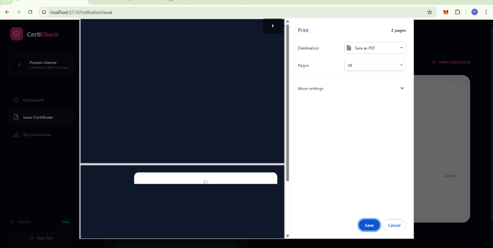

# 🎓 Fake Certificate Identification System using Blockchain & QR

A production-ready, decentralized platform designed to eliminate fraudulent credentials. This system leverages **Ethereum Blockchain** (via Ganache) and **Encrypted QR Codes** to ensure that every issued certificate is 100% authentic, immutable, and verifiable by anyone, anywhere.




## 🌟 Enhanced Features

### 🏢 Institution Portal (Issuers)
- **Side-by-Side Issuance:** Real-time certificate preview while typing.
- **Blockchain Registration:** Automatic hashing and ledger entry for every issuance.
- **PNG Graphics Engine:** High-quality certificate image generation (PNG).
- **Direct Printing:** Native browser print optimization (No Dashboard clutter).

### 🔍 Verifier Portal (Verification)
- **Optical Scan:** High-speed QR scanning via camera or file upload.
- **Hash Sanitization:** Robust handling of scanning noise and URL parsing.
- **Blockchain Check:** Direct Ethereum smart contract calls to verify fingerprints.
- **Detailed Reports:** Instant feedback on Student Name, Course, and Issue Date.

### 🛡️ Admin Control
- **Institution Management:** Approve or reject degree-granting authorities.
- **Security Audit:** Track all verification attempts (Authentic vs Fraudulent).
- **Global Stats:** Real-time analytics on issuance and verification trends.

## 🚀 Technology Stack

| Layer | Technology |
|-------|------------|
| **Backend** | Python 3.9+ (FastAPI) |
| **Frontend** | React 18 (Vite) |
| **Blockchain** | Ethereum (Web3.py + Ganache) |
| **Database** | MongoDB |
| **Design** | Tailwind CSS + Framer Motion |
| **Tools** | html-to-image, file-saver, html5-qrcode |

## 📁 Project Structure

```
├── backend/
│   ├── app/
│   │   ├── blockchain/    # Web3 logic & Smart Contract handlers
│   │   ├── routes/        # Certificate, Auth, & Verify endpoints
│   │   ├── utils/         # SHA-256 Hashing & QR Generation
│   │   └── main.py        # Application entry point
│   └── requirements.txt
│
└── frontend/
    ├── src/
    │   ├── pages/         # Institution & Verifier Dashboards
    │   ├── components/    # High-fidelity Certificate UI
    │   └── services/      # Axios API integration
    ├── package.json
    └── tailwind.config.js
```

## 🛠️ Quick Installation

### 1. Requirements
- **Ganache:** [Download](https://archive.trufflesuite.com/ganache/) (Port 7545)
- **MongoDB:** Local instance or Atlas
- **Node.js & Python**

### 2. Backend Setup
```bash
cd backend
python -m venv venv
venv\Scripts\activate
pip install -r requirements.txt
python -m uvicorn app.main:app --reload
```

### 3. Frontend Setup
```bash
cd frontend
npm install
npm run dev
```

## 🔐 Initial Credentials & Configuration

### Admin Portal
- **URL:** `http://localhost:5173/login`
- **Email:** `admin@example.com`
- **Password:** `admin123`

### Blockchain Connectivity
Ensure your `.env` in the backend folder matches your Ganache instance:
```env
GANACHE_URL=http://127.0.0.1:7545
PRIVATE_KEY=your_ganache_private_key
CONTRACT_ADDRESS=your_deployed_contract_addr
```

## 📱 User Workflow

1. **Signup** as an Institution and get **Approved** by the Admin.
2. **Issue** a certificate: Fill the form and watch the live preview.
3. **Download** the generated PNG Certificate.
4. **Scan** the QR code using the Verifier Portal to prove authenticity.

---

Built with ❤️ for Educational Integrity & Blockchain Security
